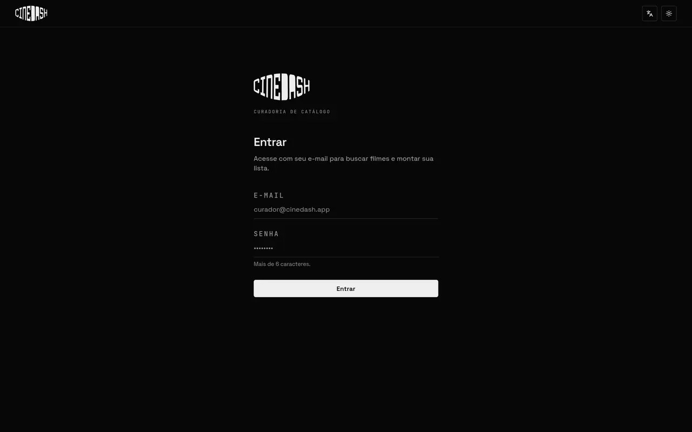
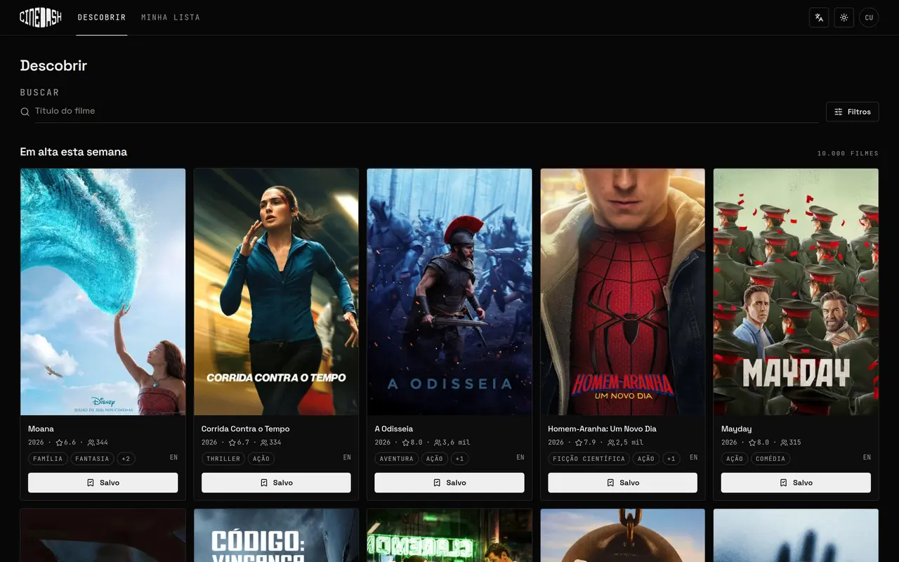
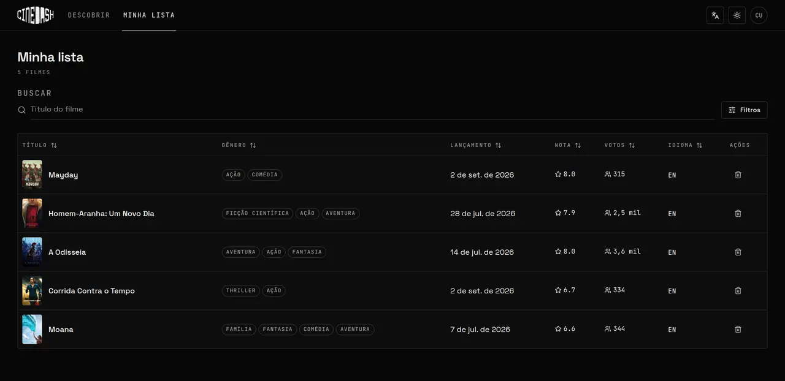
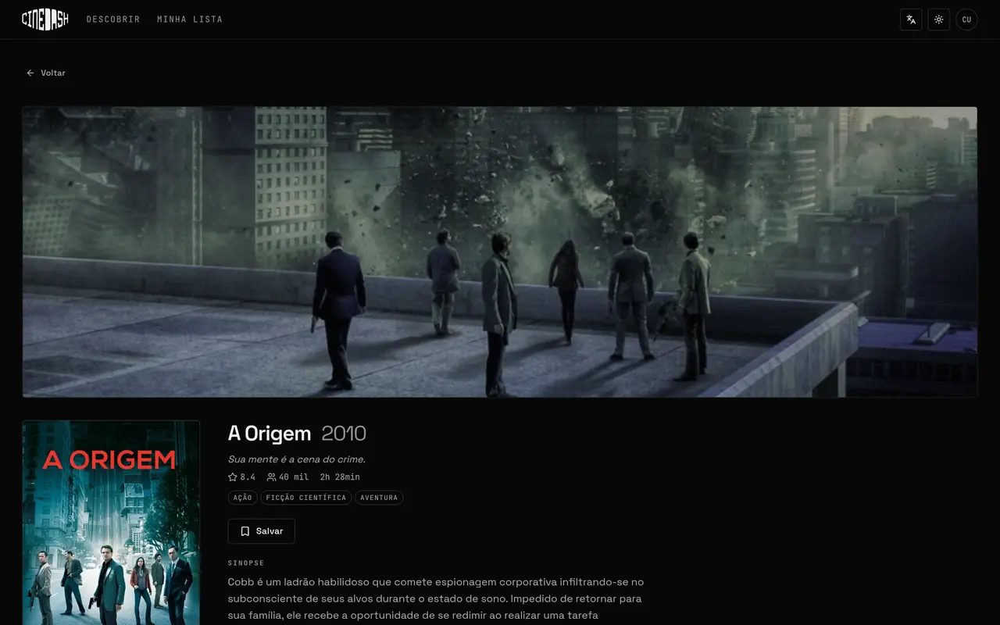
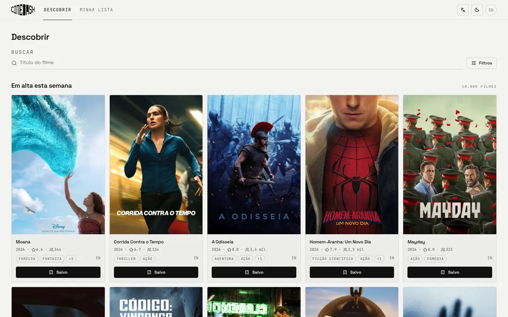
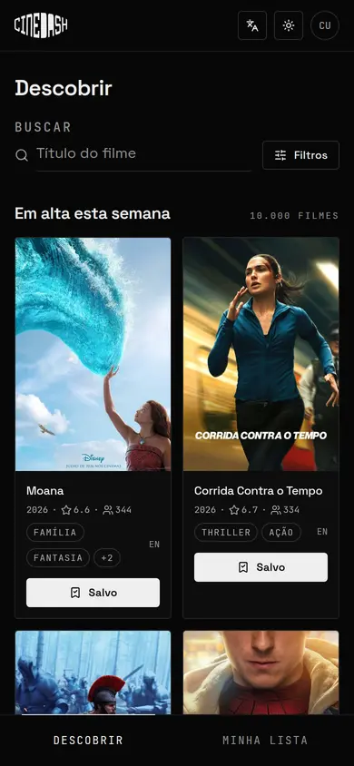
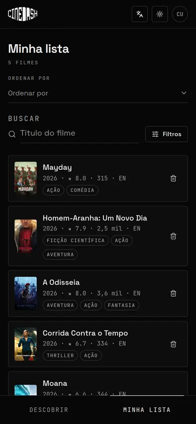

<div align="center">



# CineDash

Dashboard de curadoria e descoberta de filmes, construído sobre a API do TMDB.

[Como rodar](INSTRUCTIONS.md) · [Decisões técnicas](ARCHITECTURE.md) · [Enunciado do desafio](docs/DESAFIO.md)

</div>

---

Resolução da **Opção A** do desafio técnico para Desenvolvedor React Pleno. A proposta é um produto interno: curadores buscam, filtram e selecionam quais filmes entram no catálogo de um streaming.

## O que a aplicação faz

- **Login simulado** com validação por schema, token fictício e sessão que sobrevive ao recarregamento.
- **Descoberta** com rolagem infinita, busca com atraso proposital e sete filtros: gênero, ano, faixa de nota, faixa de duração, idioma original, mínimo de votos e ordenação.
- **Minha lista** persistida no navegador, em tabela ordenável no desktop e cartões no celular, com os mesmos filtros da descoberta.
- **Detalhes** com sinopse, elenco em carrossel, trailer sob demanda e os números do filme.
- **Três idiomas**, português, inglês e espanhol, que também mudam os dados vindos da API.
- **Tema claro e escuro**, efeitos sonoros sintetizados e preferências guardadas entre sessões.

## Telas

<table>
<tr>
<td width="50%"><br><em>Descobrir</em></td>
<td width="50%"><br><em>Minha lista</em></td>
</tr>
<tr>
<td><br><em>Detalhes</em></td>
<td><br><em>Tema claro</em></td>
</tr>
</table>

<div align="center">

&nbsp;&nbsp;

<br><em>O layout é desenhado primeiro para o celular</em>
</div>

## Stack

| Camada | Escolha |
|---|---|
| Base | React 19, TypeScript estrito, Vite 8 |
| Dados do servidor | TanStack Query |
| Estado do cliente | Zustand com persistência |
| Rotas | TanStack Router |
| Interface | shadcn/ui sobre Radix e Tailwind 4 |
| Formulários | React Hook Form e Zod |
| Tabela | TanStack Table |

## Como rodar

```bash
npm install
cp .env.example .env.local   # preencha com seu token de leitura da TMDB
npm run dev
```

O passo a passo completo, incluindo como obter o token, está em [INSTRUCTIONS.md](INSTRUCTIONS.md).

## Organização

Feature-Sliced Design, com dependências apontando sempre para baixo:

```
src/
  app/        providers, rotas e layout
  pages/      uma pasta por tela
  features/   auth, filtros, lista, tema, idioma, configurações
  entities/   o filme: tipos, adaptadores da API e componentes
  shared/     cliente da TMDB, biblioteca de UI, i18n e utilitários
```

O raciocínio por trás de cada escolha, incluindo o que a API do TMDB não permite fazer, está em [ARCHITECTURE.md](ARCHITECTURE.md).

## Qualidade

- **Acessibilidade** verificada com axe em todas as telas, nos dois temas e com menus abertos: nenhuma violação. Navegação completa por teclado, contraste dentro da WCAG AA e rótulos para leitor de tela.
- **Performance** com divisão do pacote por rota. Sair da descoberta para a lista baixa 10 kB.
- **Tipagem** sem `any`, com os dicionários de tradução conferidos em tempo de compilação.
